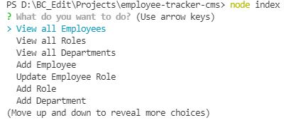
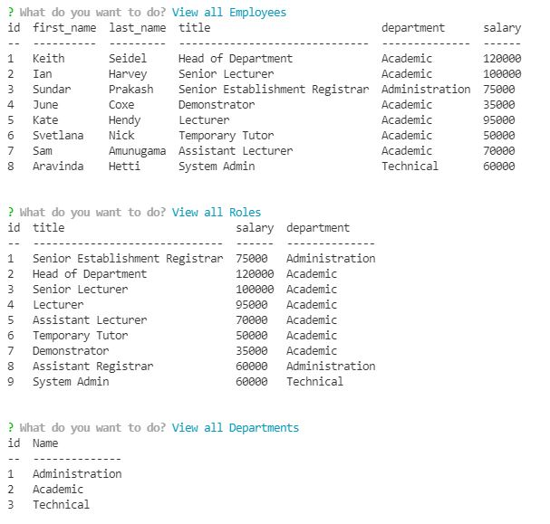
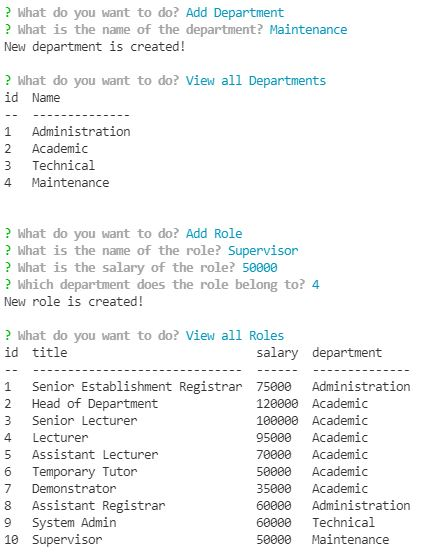
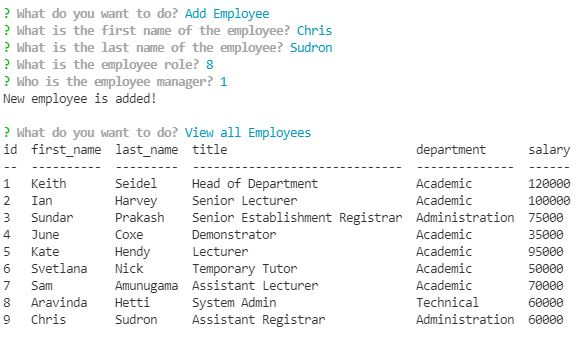
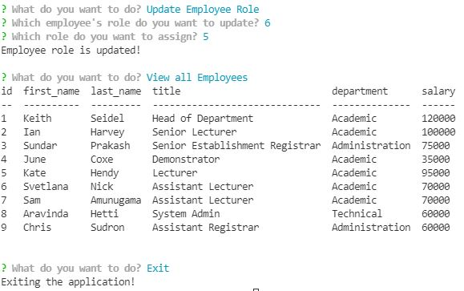

# Employee Tracker CMS

  [](https://opensource.org/licenses/MIT)
     
  ## Description
  This project is built to manipulate the data of an employee in an organization. It provides facilities to create new departments, roles and employees while providing oppotunities to view all the available details of each category. Apart from that, at this stage it provides facilities to update the position of the employees when required. This is a command line application built using Node.js and MySql. **Inquirer, MySql2 and Console.table** packages are used in the application.
  
  ## Table of Contents
  * [Important Links](#Important-Links)
  * [Mock-up](#Mock-up)
  * [Installation](#Installation)
  * [Usage](#Usage)
  * [Technical Acceptance Work Done](#Technical-Acceptance-Work-Done)
  * [Application Quality Work Done](#Application-Quality-Work-Done)
  * [Repository Quality Work Done](#Repository-Quality-Work-Done)
  * [Questions](#Questions)

  ## Important Links
  Following are the important links related to this application.
  * [Employee Tracker - Github Repo](https://github.com/vish-opatha/employee-tracker-cms)
  * [Employee Tracker - Walkthrough Video](https://personal-note-taker-v.herokuapp.com/)
  ## Mock-up
  Following images shows the landing page and notes manupulation page.

  *Initial Prompts*

  

  *View employees, roles and departments*

  

  *Add department and roles*

  

  *Add employee*

  

  *Update employee role and exiting the application*

  
  
  ## Installation
  To install the necessary dependencies, run the following command:

  ```
  npm install 
  ```
  
  ## Usage
  To use the application user needs to have MySQL Server in the computer and need to update the credentials in the connection.js file in the db folder in order to run the functionalities in the application properly. Before that run the schema.sql file and seeds.sql file in the db folder to begin.

  To start the application, run the following command:

  ```
  node index
  ```


  ## Technical Acceptance Work Done
  1. When the application loads the user is given several prompts to select the task, he/she wants to perform on the employees data.
  2. Through the prompts user can view all the details in the department, employee roles in those departments and all the details of the employees.
  3. If the user wants to add a new department relevant prompts are given and new roles also can be created when required.Prompts are given to enter details such as role title, salary and department.
  4. When the user wants to enter details of new employee prompts are given to enter name, role and manager's details if there is one.
  5. Once after each and every function if the database is queried, updated or new details are displayed in all three tables namely department, role and employee.
  ## Application Quality Work Done
  1. Inquirer prompts are designed in a way that it links to each function that user wants to perform. User can select exit to close the application. 
  ## Repository Quality Work Done
  1. Repository is named as employee-tracker-cms.
  2. Tags are indented accordingly and comments are included while following the best practices for naming conventions.
  3. Changes were committed multiple times with messages.

  ## Questions
  If you have any questions about the repo, open an issue or directly contact me at <v.opatha@gmail.com> You can find my other work at [Github](https://github.com/vish-op)